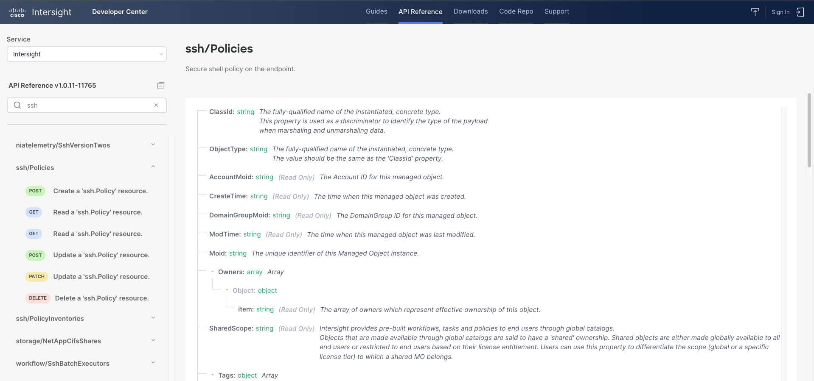

# Intersight Model and Terraform HCL for Secure Shell 

In this section, we will configure a new policy in your student organization to **enable secure shell access** on the endpoint server.

This section will closely mimic our last section on [disabling IPMI over LAN](./02-terraform-intersight-ipmi.md). As a result, we will abbreviate the instructions here.

## Identify if a SSH Policy Exists

Let's return to the [Intersight Policies](https://intersight.com/an/infrastructure-service/an/policy/policies/) tab and check if there is an existing Secure Shell (SSH) policy by simply typing **SSH** into the filter box:


No SSH policy exists in the current configuration.


Let's check the API docs for a SSH policy.  In searching for **SSH** in the Intersight REST API docs, we do indeed find the following entry: [ssh/Policy](https://intersight.com/apidocs/apirefs/ssh/Policies/model/)



Finally, let's identify the Terraform provider resource that corresponds to that model and policy, specifically [intersight_ssh_policy](https://registry.terraform.io/providers/CiscoDevNet/intersight/latest/docs/resources/ssh_policy):


## Modifying the Terraform

In the GitHub repository that you downloaded, you have been provided the stub of a Terraform configuration to implement this policy.  In the upper right editor, navigate to the **src/DEVWKS-2060-CLAMS23/02-intersight** directory and open the file **workshop-ssh.tf**.

As before, we need to make two changes to this policy:

- Remove the **count = 0** line (this is a Terraform trick to disable the resource and we need to remove it).
- Add the attribute needed to enable SSH Logins.

In looking at the **intersight_ssh_policy** screenshot above, like the IPMI over LAN, we see a similar attribute (**enabled**) that we can leverage to enable SSH login functionality on the server. Additionally, we will want to add port 22 as the designated port for secure shell access and a timeout counter of 1800 seconds before the system considers the SSH request to have timed out. To the end, your task is to edit the Terraform file **workshop-ssh.tf** in the editor to the upper right and make it resemble the following:

```
#SSH 
resource "intersight_ssh_policy" "enable_SSH_login" {
 organization {
    object_type = "organization.Organization"
    moid        = local.target_org_moid
  }
 
  name        = "enable_SSH_login"
  description = "ssh policy"


  enabled     = true
  port        = 22
  timeout     = 1800


}
```

## Deploying the Terraform

Once the file is finished, let's apply it:

```bash
cd src/DEVWKS-2060-CLAMS23/02-intersight
terraform init
terraform apply
terraform apply --auto-approve
```

The output from the **terraform apply** command is:

```
data.intersight_organization_organization.target: Reading...
intersight_ssh_policy.ssh_policy1: Refreshing state... [id=646bcce7627572310138e590]
data.intersight_organization_organization.target: Read complete after 0s [id=63f91de76972652d33c6c85d]

Terraform used the selected providers to generate the following execution plan.
Resource actions are indicated with the following symbols:
  + create

Terraform will perform the following actions:

  # intersight_ssh_policy.enable_SSH_login will be created
  + resource "intersight_ssh_policy" "enable_SSH_login" {
      + account_moid         = (known after apply)
      + ancestors            = (known after apply)
      + class_id             = "ssh.Policy"
      + create_time          = (known after apply)
      + description          = "ssh policy"
      + domain_group_moid    = (known after apply)
      + enabled              = true
      + id                   = (known after apply)
      + mod_time             = (known after apply)
      + moid                 = (known after apply)
      + name                 = "enable_SSH_login"
      + object_type          = "ssh.Policy"
      + organization         = [
          + {
              + class_id    = "mo.MoRef"
              + moid        = "63f91de76972652d33c6c85d"
              + object_type = "organization.Organization"
            },
        ]
      + owners               = (known after apply)
      + parent               = (known after apply)
      + permission_resources = (known after apply)
      + port                 = 22
      + profiles             = (known after apply)
      + shared_scope         = (known after apply)
      + tags                 = (known after apply)
      + timeout              = 1800
      + version_context      = (known after apply)
    }

Plan: 1 to add, 0 to change, 0 to destroy.


intersight_ssh_policy.enable_SSH_login: Creating...
intersight_ssh_policy.enable_SSH_login: Creation complete after 1s [id=646bd7dd62757231013c4f1f]

Apply complete! Resources: 1 added, 0 changed, 0 destroyed.

Outputs:

org_target_moid = "63f91de76972652d33c6c85d"

```
